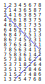
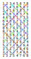
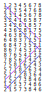

# twinklebells
_Ringing in the New Year with LEDs_

- [Introduction](#introduction)
- [Background](#background)
  - [About _The Nine Tailors_](#about-the-nine-tailors)
  - [About bell ringing](#about-bell-ringing)
  - [A brief explanation of terms](#a-brief-explanation-of-terms)
 - [Hardware](#hardware)
 - [Software](#software)
 - [Advent: Raising the bells](#advent-raising-the-bells)
 - [First Day: Rounds](#first-day-rounds)
 - [Second Day: Plain Hunting](#second-day-plain-hunting)
 - [Third Day: Grandsire Major](#third-day-grandsire-major)
 - [Fourth Day: 704 Kent Treble Bob Major](#fourth-day-704-kent-treble-bob-major)
 - [Fifth Day: Back to Rounds, with a brief pause](#fifth-dayay-back-to-rounds-with-a-brief-pause)
 - [Sixth Day: 5040 Stedman's Triples](#sixth-day-5040-stedmans-triples)
 - [Seventh Day: The Nine Tailors](#seventh-day-the-nine-tailors)
 - [Eighth Day: 15840 Kent Treble Bob Major](#eighth-day-15840-kent-treble-bob-major)
 - [Ninth Day: Holt's Ten-part Peal](#ninth-day-holts-ten-part-peal)

## Introduction

Last year I celebrated the 12 Days of Christmas by programming my Christmas lights to demonstrate [a different sort method each day](https://github.com/scripsi/xmasort). This year I'm inspired to explore the world of bell ringing in lights, after reading Dorothy L. Sayers' _The Nine Tailors_.

**The aim of this project is to visualise bell ringing methods and ring peals of changes using strings of RGB LEDs**!

## Background

### About _The Nine Tailors_

> 'Thank God' said Wimsey. 'Where there is a church, there is civilisation.'
>
> _The Nine Tailors_ - Dorothy L. Sayers

_The Nine Tailors_ is a detective novel and a love-letter to country life in the English Fens where the author Dorothy L. Sayers grew up. At the beginning of the book, her hero, Lord Peter Wimsey arrives by accident in the fictional village of Fenchurch St Paul on a snowy New Year's Eve and is instantly recruited to help ring in the New Year with a full peal on the church bells. The ensuing story is threaded through with the strange and beautiful language of bells and bell-ringing as Wimsey slowly unravels the tangle of circumstances around a gruesome discovery in the churchyard. To ensure authenticity for the story, Sayers evidently spent a long time researching the peculiarly English art of change-ringing. Puzzles and ciphers are expressed in the mathematical methods of the changes, while the bells mark out the beats of the story from that joyful New Year peal, through solemn tolling for the dead, to alarms warning of a final, dramatic and deadly flood.

### About bell ringing

> The art of change ringing is peculiar to the English, and, like most English peculiarities, unintelligible to the rest of the world
>
> _The Nine Tailors_ - Dorothy L. Sayers

The [Central Council of Church Bell Ringers](https://cccbr.org.uk/) is the fount of knowledge about the history of bell ringing in England. What began as a simple and largely secular use of church bells to announce community events grew into a complex musical art form through the 17th to 19th centuries as technological advancements in bell founding allowed ever larger and better [tuned scales of bells](https://www.hibberts.co.uk/). In Europe, this eventually resulted in carillons of bells spanning several octaves of a chromatic scale and able to [play full pieces of music](https://www.youtube.com/watch?v=8WVbmDewfnQ) either by hand or mechanically-driven. In England, things took a different tack, with ringers exploring all of the possible combinations of a diatonic scale of bells in mathematical sequences. These changes or [methods](https://ringing.org/) became ever more numerous and elaborate as bell ringing teams from neighbouring parishes competed with each other to produce the longest peals with the most harmonious sound. 

Change ringing is a team effort which requires intense concentration, physical stamina and long experience to do well. A complex terminology and tradition has built up around English bell ringing, which Sayers celebrates in her book. I have never done any bell ringing and so I've clearly got a very steep learning curve ahead of me, but it looks like it will be a fun rabbit-hole to fall down...

### A brief explanation of terms

A **Stage** indicates the number of bells being rung. A stage of 7 bells is called **Trebles**, while 8 bells are called **Major**. The bells are numbered: The highest pitch bell, the **Treble**, is number 1, and the remaining bells are numbered in order of decreasing pitch. The lowest pitch bell is the **Tenor**.

The bells are rung in a sequence indicated by their numbers. A complete sequence where every bell rings exactly once is a **Row**. A row which is rung in order from highest to lowest pitch is called **Rounds**. A bell's position within a row is called its **Place**. One or more pairs of adjacent bells in a row can swap places in the following row, which is called a **Change**. The complete set of unique rows possible with a set of bells is its **Extent** (the extent of _n_ bells = _n_!).

A sequence of changes is a **Method**. Methods can be combined into longer **Compositions**, with **Calls** used to change the method (or places of bells within the method) at strategic points. The complete sequence of changes is a **Touch** and it is **True** if each possible order of bells is rung exactly once (excluding any rows of rounds at the beginning and end). A touch of at least 5000 changes is a **Peal**. 

## Hardware

The hardware is the same as last year's project and consists of [Pimoroni Plasma 2040](https://shop.pimoroni.com/products/plasma-2040) boards connected to a variety of programmable RGB LED strings and powered using USB-C. I have three types of LED string:

- [10-metre LED star wire](https://shop.pimoroni.com/products/10m-addressable-rgb-led-star-wire) with 66 star-shaped leds
- [5-metre flexible LED wire](https://shop.pimoroni.com/products/5m-flexible-rgb-led-wire-50-rgb-leds-aka-neopixel-ws2812-sk6812) with 50 diffused LEDs
- A 1-metre strip of ws2812 60-LEDs/m, which I use for prototyping and testing

The Plasma 2040 boards are encased in [these 3D-printed enclosures](https://www.printables.com/model/261123-plasma-2040-case), which keeps them protected while potentially allowing the use of the additional buttons for control of the lights.

## Software

Pimoroni have made some breaking changes to the software for their Plasma boards in the past year. The Plasma 2040 is now "end of life", having been replaced by the Plasma 2350 and 2350W however a MicroPython software image for the Plasma 2040 is still [available here](https://github.com/pimoroni/plasma/releases/download/v1.0.0/plasma_2040-v1.0.0-micropython.uf2). [Microsoft Visual Studio Code](https://code.visualstudio.com/) is used to program the boards, with the help of the official [Raspberry Pi Pico Extension](https://marketplace.visualstudio.com/items?itemName=raspberry-pi.raspberry-pi-pico). The `main.py` program installed on each Plasma 2040 will run automatically whenever it is powered on, taking its configuration from `config.py`.

To install, copy `main.py` and `config.py` from the `src/` directory of this repository to the Plasma 2040. If using the Raspberry Pi Pico extension in VSCode, you can do this by opening the command palette with CTRL-SHIFT-P and choosing the `MicroPico: Upload file to pico` command for each file. If necessary, edit `config.py` to match your LED string before uploading.

The basic `main.py` is derived from last year's version. It imports necessary libraries, reads the config file for constants like the number of LEDs and default brightness, and has functions for managing and updating the LEDs. It then enters an infinite loop, repeatedly showing the chosen touch.

## Advent: Raising the bells

> The bells gave tongue: Gaude, Sabaoth, John, Jericho, Jubilee, Dimity, Batty Thomas, and Tailor Paul, rioting and exulting high up in the dark tower, wide mouths rising and falling, brazen tongues clamouring, huge wheels turning to the dance of the leaping ropes.
>
> _The Nine Tailors_ - Dorothy L. Sayers

So, er, I won't actually be using bells in my project. I will be using coloured lights to represent the bells and the patterns of changes as they are "rung". Nevertheless, I want to be as faithful to the ideas and principles of change-ringing as I can, by incorporating the language and notation into my programming. I also want to model the project on the story of _The Nine Tailors_, so let me introduce the bells:

| Number | Position | Name           | Colour | Hex     | Hue  |
| ------ | -------- | -------------- | ------ | ------- | ---- |
| 1      | Treble   | _Gaude_        | Purple | #AA00FF | 280° |
| 2      | Second   | _Sabaoth_      | Blue   | #0000FF | 240° |
| 3      | Third    | _John_         | Cyan   | #00AAFF | 200° |
| 4      | Fourth   | _Jericho_      | Teal   | #00FFAA | 160° |
| 5      | Fifth    | _Jubilee_      | Green  | #00FF00 | 120° |
| 6      | Sixth    | _Dimity_       | Yellow | #AAFF00 | 80°  |
| 7      | Seventh  | _Batty Thomas_ | Orange | #FFAA00 | 40°  |
| 8      | Tenor    | _Tailor Paul_  | Red    | #FF0000 | 0°   |

The eight bells form a musical octave, and are named as in the book. Each bell is represented by a different light colour, and these are chosen at simple intervals around the colour-wheel to form a rainbow gradient.

In `main.py`, the bells are represented as instances of the Bell class. When they are rung, the bells have an amplitude which decays quickly. The different LED colours represent each bell, and the brightness depends on the bell's current amplitude.

The bells are rung at 0.25 second intervals, which means that a full row of 8 bells takes about 2 seconds to ring. I chose these timings after watching several YouTube videos of bell ringing. 

## First Day: Rounds

> The position of the bells when struck at regular intervals from the highest bell, or "Treble" to the lowest or "Tenor" ... is called the position of rounds.
>
> _Change Ringing_ - Charles A. W. Troyte

I celebrate the first day of Christmas with Rounds. Rounds are usually the first and last row rung in any touch, so it seems appropriate to begin with them. The bells are simply rung repeatedly in sequence from highest to lowest:

```text
12345678
12345678
12345678
12345678
...
```

From a programming point of view, Rounds are also the simplest test that everything is working! If there are any issues with playing more complicated compositions in later days, then `main.py` will default to ringing Rounds instead. I have also added the capability to set in `config.py` the pattern of LEDs that represents each bell:

```python 
# config.py

BELL_PATTERN = 0
# -1111111222222333333444444555555666666777777888888-

BELL_PATTERN = 1
# -123456781234567812345678123456781234567812345678-

BELL_PATTERN = 2
# set a custom pattern with an array like:
# BELL_TO_LED = [[0,1,18,19],  # None
#                [2,3],        # 1 Gaude
#                [4,5],        # 2 Sabaoth
#                [6,7],        # 3 John
#                [8,9],        # 4 Jericho
#                [10,11],      # 5 Jubilee
#                [12,13],      # 6 Dimity
#                [14,15],      # 7 Batty Thomas
#                [16,17]]      # 8 Tailor Paul

```

## Second Day: Plain Hunting

> Hunting is the first part of change ringing which it is necessary to understand. It is of two sorts "hunting up" and "hunting down."
>
> _Change Ringing_ - Charles A. W. Troyte

Today is Boxing Day, which is traditionally the highlight of the hunting season in Britain. "Hunting" in bell ringing terminology is when one or more bells swap places in a consistent direction over a series of changes. Plain Hunting is a basic method in which all of the bells repeatedly hunt up and down through the places. In the following diagram, the blue line shows how bell 2 moves between one row and the next:  



An early book on change-ringing showed the position of bells with a blue line like this, so that learning a new method is often now referred to as "following the blue line". It is, of course, possible to pick out all of the bells in different colours, which looks like this for Plain Hunting:



While it would be relatively simple to create an algorithm which generates Plain Hunting automatically, there are many other ringing methods which would be much more difficult to program. For this reason, I have decided to load the changes for each day's method or composition from a separate file. This is a simple text file called `touch.txt` which is formatted as rows of bell numbers as shown above. `main.py` simply reads through the file one number at a time to find which bell to "ring" next. When the program reaches the end of the file it simply restarts from the beginning again. To update the Plasma 2040 with a new daily release, simply copy _both_ `main.py` and `touch.txt` to it and restart.

## Third Day: Grandsire Major

> 'Now, boys, if you be ready, we'll ring a little touch of 96, just to put this gentleman in the way of it, like. You'll remember, my lord, that you starts by making the first snapping lead with the treble and after that you goes into the slow hunt till she comes down to snap with you again.' 
>
> _The Nine Tailors_ - Dorothy L. Sayers

In the book, Lord Wimsey joins a practice session on handbells at the Rectory in the early evening before ringing the New Year peal in the church. The method isn't named, but the text gives a few clues, which is why I have chosen Grandsire Major for today's method. Here is the first part of the method:



Lord Peter is ringing the Number 2 bell (blue line), which begins by swapping the lead with the treble (purple line) and then hunting down through the pattern before meeting the treble again. Choosing to ring this method is a kindly reintroduction for Wimsey, because the Number 2 bell just has to follow the Treble's lead, while the other bells have more work to do.

Today's touch is taken from the excellent [Composition Library](https://complib.org/) website, which has thousands of bell ringing methods and compositions available for download and free non-commercial use. I will be relying on this website for most of the remaining days' touches!

## Fourth Day: 704 Kent Treble Bob Major

> 'The gentleman will do well enough,' agreed Mr Lavender. 'Now, boys, once again. What 'ull we make it this time, sir?'
>
> 'Make it a 704,' said the Rector, consulting his watch. 'Call her in the middle with a double, before, wrong and home, and repeat.'
>
> _The Nine Tailors_ - Dorothy L. Sayers

The practice session continues with a longer touch, probably of the Kent Treble Bob Major that Wimsey will be ringing with them later that night.

Part of my aim in doing this 12 Days project is to better understand the often baffling phrases in the book. So what does "Call her in the middle with a double, before, wrong and home" actually mean?

A bell ringing performance will have a conductor who's job it is to keep track of progress and **Call** out the names of methods and changes at important points in the touch to keep everyone on track. In this case, the conductor is Hezekiah Lavender, who rings the Tenor bell. Calls can be used to introduce variations to the basic method by making one or more bells "dodge" (change direction) between changes. Such variations can include a Bob, a Single or a **Double**. The exact timing of a call - the calling position - affects which bells make the variation. According to [Calling it Round](https://callingitround.cccbr.org.uk/docs/calling/3_demystifying_in_out_make/), an introductory text on the Central Council of Church Bell Ringers website, the terms **Before**, **Wrong** and **Home** are "calling positions relative to a specific observation bell" which would probably be the Tenor rung by Mr Lavender.

Being able to define terms is only half the story. After a deal of reading around the theory, I still feel that I have barely comprehended what it all means. Calling changes is fundamentally a performance art, and I suspect that it is only by being present in that performance can you truly begin to understand how they work!

## Fifth Day: Back to Rounds, with a brief pause

> His next stroke being a hand stroke, he will allow exactly double that interval to intervene between the striking of the Tenor and his own, and thus he will continue, causing the rounds to run in this manner,-
>
> ```
>  HAND BACK  HAND BACK  HAND BACK
> 12345123450123451234501234512345  
> ```
>
> _Change Ringing_ - Charles A. W. Troyte

As a geek, it is easy to get carried away with the formal beauty and mathematical structure of bell ringing methods, but bells are more than just numbers in a text file. Bells have mass and momentum, ropes and mechanisms, tuning and timbre. They are not swinging passively back and forth like pendulums, but are moving under the careful control of skilled people working in concert to create a performance. These subtleties are hard to reproduce in a simple microprocessor program, but there are perhaps some things I can do to make it feel more realistic.

English church bells are rung by pulling on a rope running round the edge of a large wheel attached to each bell. The bell swings slightly more than 360 degrees at each stroke, first releasing and then rewinding the rope, which is why this is called [full circle ringing](https://www.ringing.info/beginners/ringing.htm#label2). The rope is attached to the wheel asymmetrically, meaning that it finishes at a different height at the end of a forward and return swing, affecting how the ringer pulls the bell in each direction. The first, forward swing is called the **Hand-Stroke**, and the return swing is the **Back-Stroke**.

The rows in a touch will alternate between hand-stroke and back-stroke. A brief, "hand-stroke pause" is often included between the end of a back-stroke row and the start of the next hand-stroke row, as described by [Troyte](https://www.google.co.uk/books/edition/Change_Ringing/WxZPAAAAMAAJ?hl=en&gbpv=1&pg=PA8&printsec=frontcover) (page 8). I follow Troyte's example of using a "0" (zero) to indicate a brief pause equal in time to one bell's place (about 0.25 seconds). Adding a zero to alternate rows in `touch.txt` creates the hand-stroke pause described above. It would also be possible to include longer pauses made up of strings of zeroes, if necessary.

Here is today's version of Rounds with the hand-stroke pause included:

```text
# touch.txt
12345678
123456780
12345678
123456780

```

## Sixth Day: 5040 Stedman's Triples

> 'We're going to have a try at Stedman's. They're difficult to ring, are Stedman's, but very fine music when you get them going proper.'
>
> _The Nine Tailors_ - Dorothy L. Sayers

It's time to try a full peal of 5040 rows, which should take just under 3 hours to ring. The [particular touch I am using](https://complib.org/composition/28923) was composed by Thomas Thurstans and was [first rung](https://bb.ringingworld.co.uk/view.php?id=1401420) by the Ancient Society of College Youths at St. Andrew, Enfield, Middlesex on Sunday, 26th January 1851 in 2 hours and 53 minutes. The composition was rung frequently through the late 19th and early 20th Century, and is quite possibly the one rung in _The Nine Tailors_ for Easter Sunday at Fenchurch St. Paul.

Triples are meant to be rung on a stage of 7 bells, but they can also be rung on the top 7 bells of a stage of 8. In that case, the Tenor bell **Covers** by always ringing at the end of each row instead of hunting up and down with the rest of the bells. The touch as downloaded from Composition Library is only for 7 bells, so I need some way to add the number 8 (Tenor) to the end of each row (hand editing the file would be impractical!) I thought about altering `main.py` on the Plasma2040 to allow the automatic inclusion of covering bells and hand-stroke pauses (see Day 5), but this would considerably complicate the logic of the main loop, and I rather like its current simplicity. Instead, I have decided to write a separate Python script, `utils/retouch.py`, to use on my computer to refactor `touch.txt` before it gets uploaded to the Plasma2040.

## Seventh Day: The Nine Tailors

> Toll-toll-toll; and a pause; toll-toll-toll; and a pause; toll-toll-toll; the nine tailors, or teller-strokes, that mark the passing of a man. The year is dead; toll him out with twelve strokes more, one for every passing month.
>
> _The Nine Tailors_ - Dorothy L. Sayers

It is New Year's Eve. The old year is almost dead, so it is time for the nine tailors. Sayers takes the title of her book from the tolling bell [traditionally used to announce the death of someone in the village](https://www.treblesgoing.org.uk/ninetailors.html). The nine tailors rung on Tailor Paul by Hezekiah Lavender at New Year foreshadow the times that they are rung later in the story to announce the deaths of characters in the book.

Creating `touch.txt` for the nine tailors simply involves successive rows where only the Tenor (number 8) rings, with long strings of zeros in between for the pauses.

I've also made a change to the behaviour of `main.py` in response to yesterday's peal of 5040 Stedman's Triples. When ringing long peals, I want to be able to control when they start and to know when they end, rather than letting them repeat continuously. To do this I have enabled Button A on the Plasma2040. Now, when `main.py` is started, it will "raise the bells" by ringing all 8 of them once and then wait for you to press Button A to start playing the touch (equivalent to the conductor shouting "Go!" to the ringers). Then, if `touch.txt` contains a 9 the main loop will pause at that point and wait for you to press Button A again. To trigger a pause at the end of a touch, rather than it going straight back to the beginning and running again, simply add a 9 to the end of `touch.txt`.

## Eighth Day: 15840 Kent Treble Bob Major

> 'Bless my heart!' said Wimsey. 'Fifteen thousand-'
>
> 'Eight hundred and forty,' said the Rector.
>
> Wimsey made a rapid calculation.
>
> 'A good many hours' work there.'
>
> 'Nine hours,' said the Rector, with relish.
>
> 'Well done, sir,' said Wimsey.
>
> _The Nine Tailors_ - Dorothy L. Sayers

This is the big one! It's New Year's Day and time to ring the same marathon peal that Lord Peter Wimsey joins in with at New Year in the beginning of the book. Just like in the book, I set the nine tailors going just before midnight on New Year's Eve. Then I started the touch of 15,840 Kent Treble Bob Major on the stroke of midnight so that the first row of rounds lit up as the fireworks exploded above the castle here in Edinburgh and the refrain of _Auld Lang Syne_ drifted up from the revellers in the street.

Happy New Year!

## Ninth Day: Holt's Ten-part Peal

> '...I remember it very well. I was a youngster at the time, and their wedding-bells was the first long peal I ever rang. We gave them 5,040 Grandsire Triples, Holt's Ten-part Peal - you'll find the record of it in the church yonder...'
>
> _The Nine Tailors_ - Dorothy L. Sayers

Today's full peal is an old one: the [Ten Part Peal](https://complib.org/composition/29040) composed by [John Holt](https://en.wikipedia.org/wiki/John_Holt_(composer)) in the early 1750s. It is a popular composition that has been rung frequently since it was composed. Once again, it is a Triple, so the Tenor bell has to cover.


